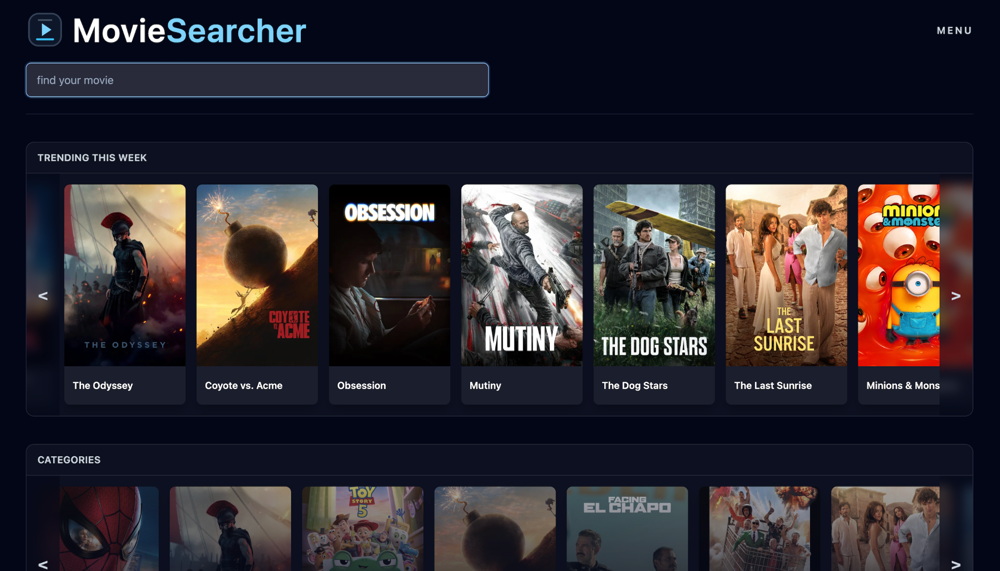

# Movie App 🎬

A responsive movie discovery application built with **React** and **TypeScript**, using the **TMDB API** for movie data.

The project allows users to search for movies, browse trending titles and categories, view detailed movie information, and manage their own favorites list.

### 🚀 [Live Demo](https://movie-app-iota-fawn-79.vercel.app/)

---

## Preview



## Features

- Search movies by title
- Debounced search to reduce unnecessary API requests
- Browse trending movies
- Explore movies by category
- View dedicated movie details pages
- Add and remove movies from favorites
- Favorites state managed with Redux
- Favorites persisted in LocalStorage
- Client-side routing with React Router
- Responsive interface styled with Tailwind CSS

## Tech Stack

- **React**
- **TypeScript**
- **Redux**
- **React Router**
- **Tailwind CSS**
- **Axios**
- **Vite**
- **TMDB API**

## Getting Started

### Prerequisites

To run the project locally, you need:

- Node.js
- npm
- TMDB API key

### Installation

Clone the repository:

```bash
git clone https://github.com/werbel7777/movie-app.git
cd movie-app
```

Install dependencies:

```bash
npm install
```

Create a `.env` file in the project root:

```env
VITE_TMDB_BASE_URL=https://api.themoviedb.org/3
VITE_TMDB_API_KEY=your_tmdb_api_key
```

Start the development server:

```bash
npm run dev
```

## Available Scripts

```bash
npm run dev
```

Runs the application in development mode.

```bash
npm run build
```

Builds the application for production.

```bash
npm run lint
```

Runs ESLint checks.

```bash
npm run preview
```

Previews the production build locally.

## Project Structure

```text
src/
├── components/    Reusable UI components
├── hooks/         Custom React hooks
├── pages/         Route-level pages
├── services/      API service functions
└── types/         Shared TypeScript types
```

The application separates reusable UI components, API communication, custom hooks, route-level views, and shared TypeScript definitions to keep the codebase easier to maintain and extend.

## API

Movie data is provided by **The Movie Database (TMDB) API**.

The API configuration is stored in environment variables rather than directly in the source code.

| Variable | Description |
| --- | --- |
| `VITE_TMDB_BASE_URL` | Base URL for the TMDB API |
| `VITE_TMDB_API_KEY` | API key used to access TMDB data |

## Roadmap

Some improvements planned for future versions:

- Improve loading and empty states
- Add richer movie metadata
- Improve accessibility
- Further improve the mobile experience
- Add pagination or infinite scrolling

## Author

Created by **Dawid** as part of my ongoing development in React and TypeScript.

[GitHub Profile](https://github.com/werbel7777)
